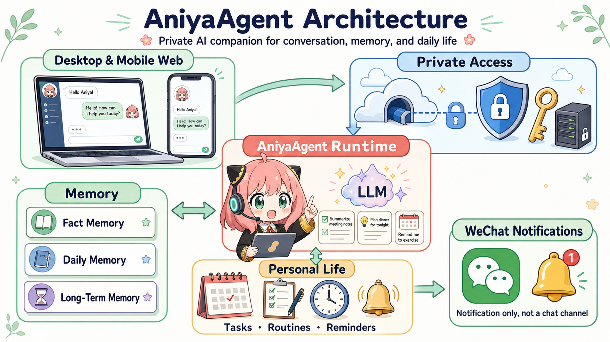

# AniyaAgent

[English](README.md) | [简体中文](README.zh-CN.md)

A private AI assistant that runs on your own computer. It can chat, remember what matters, manage tasks and schedules, and send reminders to WeChat. Your data and tools stay on your device; AniyaAgent connects the pieces.

## What It Does

- **Gets things done**: understands natural language, uses local tools, and works with files, commands, and tasks.
- **Keeps context**: separates factual memory, daily memory, and long-term memory so conversations stay useful.
- **Organizes daily life**: handles tasks, routines, scheduled reminders, and background work.
- **Stays within reach**: use it from a desktop or mobile browser; optionally access it remotely through a Cloudflare Worker relay.
- **Notifies without hijacking chat**: WeChat is a notification channel, not a conversation entry point.

## Architecture



A request travels through five clear layers:

1. **Entry**: the Web Client serves desktop and mobile browsers; a Worker can relay remote access.
2. **Access**: an Owner Token protects private access, so a local assistant does not become a public service by accident.
3. **Runtime**: the Agent Runtime interprets requests, calls the LLM, orchestrates tools, and returns results to the conversation.
4. **State**: three memory layers retain facts, daily context, and confirmed long-term information; the scheduler handles tasks, routines, and reminders.
5. **Notifications**: when something needs attention, the runtime sends a WeChat reminder without taking over the conversation.

## Quick Start

Requirements: Python 3.10+ and a model service compatible with the Anthropic or OpenAI API.

```powershell
cd C:\Users\24021\Desktop\java\learnclaudecode\AniyaAgent
pip install -r main/requirements.txt
Copy-Item main/.env.example main/.env
```

Edit `main/.env`. At minimum, configure `ANIYAAGENT_OWNER_TOKEN` plus the API key and model ID for your selected model provider.

Start the Web Client. It launches the local Agent service automatically:

```powershell
cd main/client
npm install
npm run build
npm start
```

The terminal prints desktop and LAN URLs. Open the LAN URL on your phone, then enter the Owner Token.

For scheduled reminders, routines, and WeChat notifications, start the scheduler in another terminal:

```powershell
python -m main.channel.run_scheduler
```

You can also run the Agent directly in the terminal:

```powershell
python -m main.agent.main_loop
```

## Mobile Access

For local use, open the LAN URL printed by the Web Client. For remote access, deploy the Cloudflare Worker in `main/client/worker` and configure independent, high-entropy values for `ANIYAAGENT_WORKER_URL` and `ANIYAAGENT_SESSION_ID`.

## Security

`main/.env` contains model credentials and access tokens; never commit it. AniyaAgent is intended for private personal use. A multi-user deployment needs its own authentication, authorization, audit trail, and stronger execution isolation.

## License

No license has been specified yet.
