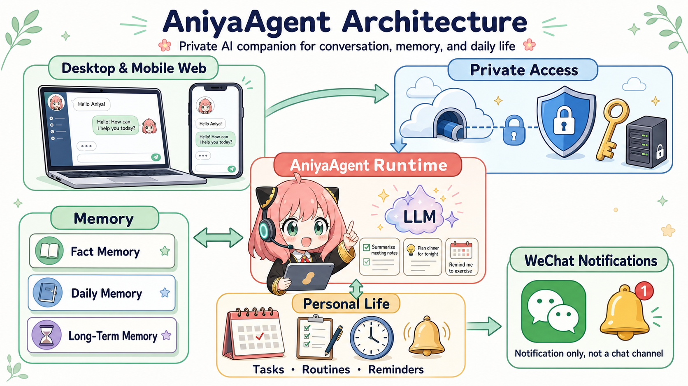

# AniyaAgent

[English](README.md) | [简体中文](README.zh-CN.md)

一个本地优先的个人 AI Agent：把对话变成可执行的工作，同时不把你的工作环境交给云端助手。

AniyaAgent 运行在你的电脑上，把原本分散的对话、待办、文件、日程、提醒、编程工作和本地工具连接起来。它可以理解请求、提出或执行动作、保留有价值的上下文，并让长期任务持续推进，而控制权始终在你手里。

默认情况下，控制面都留在本机：凭据、附件、记忆、排队工作和工具执行不会离开你的设备。远程访问是可选能力，并且需要明确保护，不会被默认开启。

## 核心能力

- **从对话到动作**：把自然语言请求转成明确的动作，可处理本地文件、命令、待办和已连接的工具。动作可以复核、排队、恢复或取消，而不是消失在聊天记录中。
- **个人工作系统**：把待办、例行事项、日程、提醒、后台任务和跟进事项放进同一个可持续运行的系统。
- **有边界的记忆**：区分事实记忆、每日记忆和长期记忆，保留真正有用的上下文，而不是把每一句话都当成永久个人数据。
- **编程搭档**：通过专用执行器、预算、产物和项目上下文处理编程工作，并可与普通助理任务协同。
- **本地与移动访问**：可通过局域网在桌面或手机浏览器使用；确有远程需要时，再接入 Cloudflare Worker 中转。
- **提醒而非另一个收件箱**：微信只负责发送通知，不会成为主要聊天入口。

## 它和普通聊天机器人的不同

AniyaAgent 不是在 LLM 外面套一层聊天界面。它是一个本地运行时：上下文会被有意识地组装，请求会被路由到合适的执行器，动作与事件能够被跟踪，长时间任务也可以在单次回复之外继续执行。它更适合反复出现的个人工作流，而不只是回答一次问题。

## 架构



一次请求会经过以下路径：

1. **入口层**：桌面或手机浏览器进入 Web Client；远程场景可经 Worker 安全中转。
2. **访问层**：Owner Token 保护私有访问，避免把本机助手暴露成公开服务。
3. **运行时**：Agent Runtime 负责理解请求、调用 LLM、编排工具，并把结果带回对话。
4. **状态层**：三层记忆保存事实、当天脉络和确认后的长期信息；任务、例行和提醒由调度器持续处理。
5. **通知层**：需要你知道时，运行时通过微信发送提醒；微信不会接管对话。

## 快速开始

环境要求：Python 3.10+，以及一个兼容 Anthropic 或 OpenAI API 的模型服务。

```powershell
cd C:\Users\24021\Desktop\java\learnclaudecode\AniyaAgent
pip install -r main/requirements.txt
Copy-Item main/.env.example main/.env
```

编辑 `main/.env`，至少配置 `ANIYAAGENT_OWNER_TOKEN` 和所选模型服务的 API Key / Model ID。

启动网页客户端（它会自动启动本机 Agent 服务）：

```powershell
cd main/client
npm install
npm run build
npm start
```

终端会显示桌面和局域网地址。用手机打开局域网地址，输入 Owner Token 后即可使用。

需要定时提醒、例行事项和微信通知时，另开一个终端启动调度器：

```powershell
python -m main.channel.run_scheduler
```

也可以不启动网页，直接在终端运行 Agent：

```powershell
python -m main.agent.main_loop
```

## 手机访问

本地使用时，打开网页客户端输出的局域网地址即可。远程访问可部署 `main/client/worker` 中的 Cloudflare Worker，并为 `ANIYAAGENT_WORKER_URL` 与 `ANIYAAGENT_SESSION_ID` 配置独立、足够随机的值。

## 安全提示

`main/.env` 中含有模型密钥和访问令牌，绝不能提交到仓库。AniyaAgent 面向个人私有使用；若要提供给多人使用，需要自行补齐认证、授权、审计和更严格的执行隔离。

## License

暂未指定许可证。
